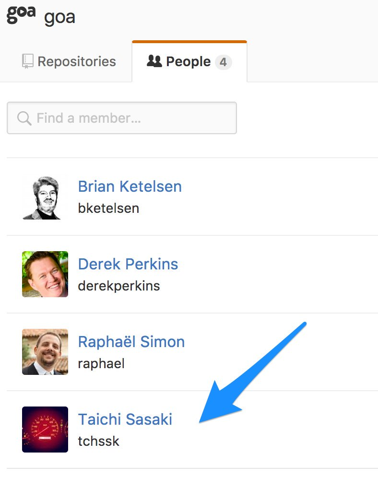

# The improvement and enhancement of goa
<!-- .slide: data-transition="fade" -->
<!-- .slide: data-background-color="#0097a7" -->

\#goastudy

2017/06/16 @tchssk

---

## Who am I 😎
<!-- .slide: data-transition="fade" -->
<!-- .slide: data-background-color="#0097a7" -->

@tchssk (Taichi Sasaki)



A contributor of goa <span style="color:#b2ebf2">since April 2016.</span>

A member of goa team <span style="color:#b2ebf2">since February 2017</span>.

---

## Agenda 📝
<!-- .slide: data-transition="fade" -->
<!-- .slide: data-background-color="#0097a7" -->

Today I talk about my activities on goa.

- Adding features and fixing bugs on v1
- Document improvement	
- Development of v2

---

## Adding features ✨<br>and<br>fixing bugs 🐛<br>on v1
<!-- .slide: data-transition="fade" -->
<!-- .slide: data-background-color="#0097a7" -->

---

### Add a DSL OptionalPayload
<!-- .slide: data-transition="fade" -->
<!-- .slide: data-background-color="#0288d1" -->

[https://github.com/goadesign/goa/pull/507](https://github.com/goadesign/goa/pull/507)

(Since v1.0.0)

---

#### What is payload
<!-- .slide: data-transition="fade" -->
<!-- .slide: data-background-color="#455a64" -->

> An action payload describes the HTTP request body data structure.

In goa you can use the DSL `Payload` like below.

```go
Payload(func() {
	Member("id")
	Required("id")
})
```

---

#### The problem
<!-- .slide: data-transition="fade" -->
<!-- .slide: data-background-color="#455a64" -->

```go
Action("update", func() {
	Routing(
		PUT("/:accountID"),
	)
	Params(func() {
		Param("accountID", Integer, "Account ID")
	})
	Payload(func() {
		Member("name")
		Required("name")
	})
})
```

I sent a request with no payload to the above action.

```sh
curl localhost:8080/1
```

It seemed it should return `400 Bad Request` when no payload provided but doesn't.

---

#### Author of goa @raphael said
<!-- .slide: data-transition="fade" -->
<!-- .slide: data-background-color="#455a64" -->


> A payload with required fields is not the same as a required payload.

---

#### Required payload vs Optional payload
<!-- .slide: data-transition="fade" -->
<!-- .slide: data-background-color="#455a64" -->

| Required payload | Optional payload |
| --- | --- |
| Client must send a request with payload. | Client can send a request with no payload. |
| Server returns `400 Bad Request` when no payload provided. | Server doesn't returns `400 Bad Request` when no payload provided. It validates the payload fields when provided. |

---

<!-- .slide: data-transition="fade" -->
<!-- .slide: data-background-color="#455a64" -->


> We need a new DSL.

---

#### Implementation
<!-- .slide: data-transition="fade" -->
<!-- .slide: data-background-color="#455a64" -->

1. Add a field `PayloadOptional` to the struct `ActionDefinition`.

    ```go
    PayloadOptional bool
    ```

2. Change to generate nil check for payload when `PayloadOptional` is `false`.

3. Add a DSL `OptionalPayload`. It turns `PayloadOptional` `true`.

    ```go
    func Payload(p interface{}, dsls ...func()) {
    	payload(false, p, dsls...)
    }

    func OptionalPayload(p interface{}, dsls ...func()) {
    	payload(true, p, dsls...)
    }
    ```

---

#### How to use
<!-- .slide: data-transition="fade" -->
<!-- .slide: data-background-color="#455a64" -->

- You can use the DSL `Payload` to define a required payload.

    ```go
    Payload(func() {
        Member("id")
        Required("id")
    })
    ```

- Also you can use the DSL `OptionalPayload` to define a optional payload.

    ```go
    OptionalPayload(func() {
        Member("id")
        Required("id")
    })
    ```

---

<!-- .slide: data-transition="fade" -->
<!-- .slide: data-background-color="#455a64" -->


The pull request was merged with following words.

> Looks great, thank you!

He is very good at complimenting.

---

<!-- .slide: data-transition="fade" -->
<!-- .slide: data-background-color="#455a64" -->

We discuss about the codes every pull request, like this.  
It's very fun 😆

---

### Support swagger extensions
<!-- .slide: data-transition="fade" -->
<!-- .slide: data-background-color="#0288d1" -->

[https://github.com/goadesign/goa/pull/779](https://github.com/goadesign/goa/pull/779)

(Since v1.1.0)

---

#### What is swagger
<!-- .slide: data-transition="fade" -->
<!-- .slide: data-background-color="#455a64" -->

> The World's Most Popular Framework for APIs.

Also known as OpenAPI Specification.  
goa has a builtin generator for swagger.

---

#### What is swagger extensions
<!-- .slide: data-transition="fade" -->
<!-- .slide: data-background-color="#455a64" -->

> Custom properties to be added at several places within a Swagger definition

```json
{
   "swagger": "2.0",
   "info": {
      "title": "The virtual wine cellar",
      "description": "A basic example of goa",
      "x-api": {"foo": "bar"}
    }
  }
}
```

---

#### Implementation
<!-- .slide: data-transition="fade" -->
<!-- .slide: data-background-color="#455a64" -->

1. Extend the DSL `Metadata` to support `swagger:extension`.

    ```go
    Metadata("swagger:extension:x-api", `{"foo":"bar"}`)
    ```

2. Add a field `Extensions` to the structs for swagger.

    ```go
    Extensions map[string]interface{} `json:"-"`
    ```

3. Override `json.Marshaler` of the each struct.

    ```go
    type _Info Info

    func (i Info) MarshalJSON() ([]byte, error) {
        // marshalJSON merges i.Extensions to i.
        // _Info is used to avoid recursive call of json.Marshal().
        return marshalJSON(_Info(i), i.Extensions)
    }
    ```

---

#### Use case
<!-- .slide: data-transition="fade" -->
<!-- .slide: data-background-color="#455a64" -->

You can use it on some cloud computing services.

- [Amazon API Gateway (Amazon Web Services)](https://aws.amazon.com/api-gateway/)
- [Cloud Endpoints (Google Cloud Platform](https://cloud.google.com/endpoints/)

The goa official blog introduces how to add authentication to Cloud Endpoints using swagger extensions.

- [From Design To Production](https://goa.design/blog/002-endpoints/)   

---

### Avoid using variables' name same with arguments in test helpers
<!-- .slide: data-transition="fade" -->
<!-- .slide: data-background-color="#0288d1" -->

[https://github.com/goadesign/goa/pull/1084](https://github.com/goadesign/goa/pull/1084)

(Since v1.2.0)

---

#### Test helpers
<!-- .slide: data-transition="fade" -->
<!-- .slide: data-background-color="#455a64" -->

Test helpers are functions to test each case of controllers.

```go
func ShowAccountOK(
    t goatest.TInterface,
    ctx context.Context,
    service *goa.Service,
    ctrl app.AccountController,
    accountID int
) (http.ResponseWriter, *app.Account) {
    // ...
}
```

Above function can be used to test below case.

```go
func (b *AccountController) Show(c *app.ShowAccountContext) error {
	account, ok := b.db.GetAccount(c.AccountID)
	if !ok {
		return c.NotFound()
	}
	return c.OK(ToAccountMedia(&account))  // This case.
}
```

---

#### The problem
<!-- .slide: data-transition="fade" -->
<!-- .slide: data-background-color="#455a64" -->

- Test helpers use some local variables.
- Test helpers have arguments required to test the controller.
- There was a possibility that their names overlapped.

---

#### Implementation
<!-- .slide: data-transition="fade" -->
<!-- .slide: data-background-color="#455a64" -->

1. Reserve names for the test target.

    - URL path params
    - URL query params
    - HTTP headers
    - HTTP request payloads
    - HTTP response media types

2. Add a template function to escape reserved names.

2. Escape the local variables of the test helper in template execution.

---

### More Improvements will come
<!-- .slide: data-transition="fade" -->
<!-- .slide: data-background-color="#0288d1" -->

- Add an argument to CollectionOf()

    [https://github.com/goadesign/goa/pull/1232](https://github.com/goadesign/goa/pull/1232)

- Support RFC1123 in the DSL Format

    [https://github.com/goadesign/goa/pull/1247](https://github.com/goadesign/goa/pull/1247)

(Since v1.3.0 ?)

---

## Document improvement 📄
<!-- .slide: data-transition="fade" -->
<!-- .slide: data-background-color="#0097a7" -->

---

### Japanese translation 🇯🇵<br>of<br>official web site
<!-- .slide: data-transition="fade" -->
<!-- .slide: data-background-color="#0288d1" -->

(2016 Autumn to 2017 Spring)

---

#### Japanese translation
<!-- .slide: data-transition="fade" -->
<!-- .slide: data-background-color="#455a64" -->

Now it is available at https://goa.design/ja/.

---

#### Translation
<!-- .slide: data-transition="fade" -->
<!-- .slide: data-background-color="#455a64" -->

Work at https://github.com/goadesign-jp.

- @ikawaha
- @tchssk


Maybe it is useful for Japanese developers (including me).

---

## Developmen of v2 🔨
<!-- .slide: data-transition="fade" -->
<!-- .slide: data-background-color="#0097a7" -->

---

### v2 is work in progress 🚧
<!-- .slide: data-transition="fade" -->
<!-- .slide: data-background-color="#0288d1" -->

---

#### Overview of v2
<!-- .slide: data-transition="fade" -->
<!-- .slide: data-background-color="#455a64" -->

- v2 keeps the "design first" approach.
- It supports multiple transports.
    - REST (such as supported by v1)
    - gRPC
- Brand new DSLs.
    - The DSLs of v1 and v2 have no compatibility.
- It is difficust to develop multiple transports.
- It will take a while.

---

#### Future of v1
<!-- .slide: data-transition="fade" -->
<!-- .slide: data-background-color="#455a64" -->

- v1 will maintain for a while.
- It still have room for improvement.
- You can send feedback via the following methods.
    - Open an issue on GitHub.
    - \#goadesign hashtag on Twitter.
    - \#goa channel on Gophers Slack.
    - \#goa-jp channel on Gophers Slack.
